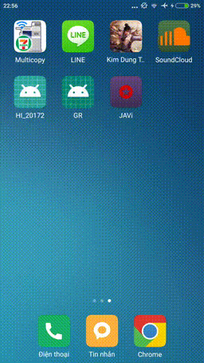

# dict
> This Android application is Japanese-Vietnamese dictionary. The application is incomplete and has been dropped

## Installation
> This application was tested with Xiaomi Mi 4c (Android 5.1.1)
- Download Android Studio, build, and run project.
- Or download APK file at: https://github.com/ducbet/dict/raw/master/app/build/outputs/apk/app-debug.apk
## Features
- Use the Realm Database (converted from public SQL database)
- Search Japanese-Vietnamese words, Vietnamese-Japanese words, Kanjis, Grammars
- Add to favorite, flashcard box
- Auto-recorded search history 
- Can jump to linked kanji when viewing the Japanese word
- The application has been simulated the same as a notebook for more concentrated when learning.